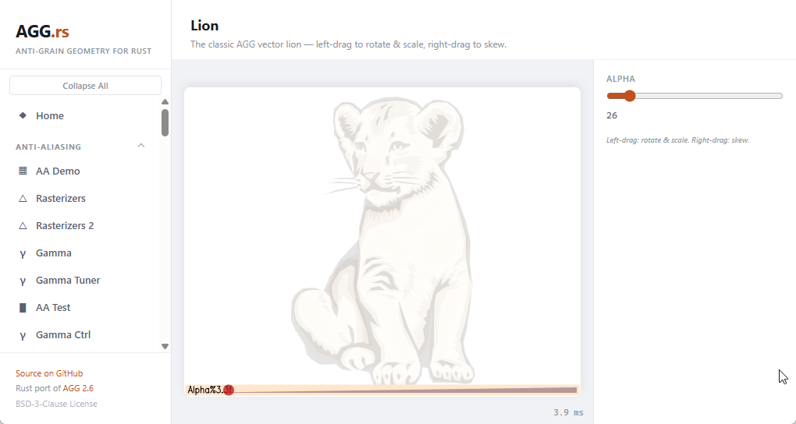

# AGG.rs — Anti-Grain Geometry for Rust

[](LICENSE)
[](https://crates.io/crates/agg-rust)
[](#)
[](#)
[](https://larsbrubaker.github.io/agg-rust/)

## Support the Project

<a href="https://buymeacoffee.com/larsbrubaker"></a>

AGG.rs is open-source and free to use, maintained in spare time as a labor of love. Friends James Smith and Dan Ruskin help out from time to time too.

If you find it useful, here are a few ways to help keep development going:

- **Donations:** [Buy Me a Coffee](https://buymeacoffee.com/larsbrubaker) — every coffee helps.
- **Star the repo:** Costs nothing and helps others find the project.
- **Report issues:** [Open an issue](https://github.com/larsbrubaker/agg-rust/issues) for bugs or feature ideas.
- **Contribute:** PRs welcome — open an issue first to discuss larger changes.

A pure Rust port of [Anti-Grain Geometry (AGG) 2.6](https://github.com/ghaerr/agg-2.6) — the legendary high-quality 2D software rendering library originally written in C++ by [Maxim Shemanarev](http://www.antigrain.com). Zero external dependencies. Pixel-perfect anti-aliased output. No GPU required.

**[Try the Interactive Demo](https://larsbrubaker.github.io/agg-rust/)** — 64 demos running entirely in your browser via WebAssembly.

Crate listing: **[`agg-rust` on crates.io](https://crates.io/crates/agg-rust)**.

> Part of the [rust-apps](https://github.com/larsbrubaker/rust-apps) suite — a collection of Rust graphics and geometry libraries by Lars Brubaker.

<p align="center">
  <a href="https://larsbrubaker.github.io/agg-rust/">
    
  </a>
</p>

## Features

AGG is a software rendering engine that produces pixel images in memory from vectorial data. It is platform-independent and achieves exceptional rendering quality through:

- **Anti-Aliasing** — subpixel-accurate scanline rasterization
- **Affine & Perspective Transforms** — rotation, scaling, skewing, and full perspective warps
- **Gradient Fills** — linear, radial, focal-point, and custom gradient functions with multi-stop color interpolation
- **Gouraud Shading** — smooth per-vertex color interpolation across triangles and meshes
- **Image Filtering** — 17 interpolation filters including bilinear, bicubic, sinc, Blackman, and more
- **30+ Compositing Modes** — full SVG 1.2 compatible Porter-Duff and blend operations
- **Stroke & Dash Generation** — configurable line joins, caps, dashes, and markers
- **Alpha Masking** — arbitrary clip regions through grayscale alpha masks
- **Stack Blur** — fast approximate Gaussian blur with adjustable radius
- **Pattern Fills** — tiled and resampled pattern rendering with perspective support
- **Built-in Fonts** — 34 embedded bitmap fonts plus vector text via GSV text engine
- **Boolean Operations** — scanline-level union, intersection, difference, and XOR

## Architecture

AGG uses a five-stage rendering pipeline with interchangeable components:

```
Vertex Source → Coordinate Conversion → Scanline Rasterizer → Scanline Container → Renderer
```

Each stage is a trait in the Rust port, allowing components to be freely mixed and matched:

| Stage | Purpose | Examples |
|-------|---------|----------|
| **Vertex Source** | Generates path vertices | `PathStorage`, `Ellipse`, `RoundedRect`, `GsvText` |
| **Coordinate Conversion** | Transforms and processes paths | `ConvCurve`, `ConvStroke`, `ConvDash`, `ConvTransform` |
| **Scanline Rasterizer** | Converts paths to scanlines | `RasterizerScanlineAa`, `RasterizerCompoundAa` |
| **Scanline Container** | Stores scanline coverage data | `ScanlineU8`, `ScanlineP8`, `ScanlineBin` |
| **Renderer** | Writes pixels to the buffer | `RendererScanlineAaSolid`, `RendererBase`, pixel formats |

## Interactive Demos

All 64 demos run in-browser via WebAssembly with no server-side processing. Categories include:

| Category | Demos | Highlights |
|----------|-------|------------|
| **Anti-Aliasing** | AA Demo, Rasterizers, Gamma, AA Test | Subpixel rendering quality visualization |
| **Rendering** | Lion, Perspective, Circles, Alpha Masks, Blur | Complex vector scenes with transforms |
| **Gradients** | Linear/Radial, Gouraud, Focal Point, Mesh | Multi-stop color interpolation |
| **Paths & Strokes** | Stroke, Contour, Dash, Line Patterns | Join/cap styles, dash patterns |
| **Curves** | Bezier, B-Spline, Text on Curve | Interactive control point editing |
| **Images & Filters** | 17 Filter Types, Perspective, Resample | Image transform and filter quality |
| **Compositing** | SVG Blend Modes, Flash Rasterizer | Porter-Duff and blend operations |
| **Patterns** | Pattern Fill, Perspective, Resample | Tiled pattern rendering |
| **Text** | GSV Vector Text, 34 Raster Fonts | Built-in font rendering |

**[Browse all demos →](https://larsbrubaker.github.io/agg-rust/)**

## Quick Start

```toml
[dependencies]
agg-rust = "1.0"
```

```rust
use agg_rust::*;

// Create a rendering buffer
let mut buf = vec![0u8; width * height * 4];
let mut rbuf = RenderingBuffer::new(&mut buf, width, height, width * 4);

// Set up the pixel format and renderer
let mut pixfmt = PixfmtRgba32::new(&mut rbuf);
let mut ren_base = RendererBase::new(&mut pixfmt);
ren_base.clear(&Rgba8::new(255, 255, 255, 255));

// Create a path and rasterize it
let mut path = PathStorage::new();
path.move_to(10.0, 10.0);
path.line_to(100.0, 50.0);
path.line_to(50.0, 100.0);
path.close_polygon();

let mut ras = RasterizerScanlineAa::new();
let mut sl = ScanlineU8::new();
ras.add_path(&mut path);
render_scanlines_aa_solid(&mut ras, &mut sl, &mut ren_base, &Rgba8::new(200, 80, 80, 255));
```

## Development

### Prerequisites

- Rust 1.70+ (`rustup install stable`)
- wasm-pack (for WASM demos)
- Bun (for demo dev server)

### Building & Testing

```bash
cargo build
cargo test                    # 990 tests
cargo clippy -- -D warnings
```

### Running the Demo Locally

```bash
cd demo
bun install
bun run build:wasm
bun run dev
```

Then open `http://localhost:3000` in your browser.

## Project Status & Goals

AGG.rs began as a strict, byte-for-byte port of AGG 2.6: all 88 core library modules are ported, all 64 applicable demos run via WebAssembly, and 990 tests pass. The byte-identity of the rendering pipeline is locked by the reference-test suite — the **Byte-identical** column in the [benchmarks](#benchmarks) below is the proof, with every benchmarked demo matching the C++ output exactly. That port is complete.

The project is now **beyond the port**: new features, Rust-idiomatic APIs, performance work, and bug fixes are all welcome. C++ behavioral matching remains the default baseline. A deliberate divergence is allowed only to fix a demonstrable bug inherited from the C++ original, and it must be documented in the code and locked with a regression test (see the gradient-LUT off-by-one fix in `src/gradient_lut.rs` for the model). Contributions that clear that bar — a real-world use case, tests proving correctness, and clean idiomatic design — are exactly the kind the project wants. Performance is an active goal: the benchmark table shows where each demo stands against C++ today.

| Metric | Value |
|--------|-------|
| Core modules ported | 88 |
| Tests passing | 990 |
| Interactive demos | 64 |
| External dependencies | 0 |
| GPU dependencies | 0 |

## Benchmarks

The Rust port is benchmarked head-to-head against the original AGG 2.6 C++ library
on a shared set of demos. Both sides render **the same scene at the same size**, and
timings cover **the render call only** (no process startup, asset loading, or file
I/O). Each demo runs 2 untimed warmups followed by 25 timed iterations; from those
samples both the **best (minimum)** and the **median** are reported for each side.
**Best-of is the primary signal** — the fastest run is the least contaminated by OS
scheduling jitter — with the median as a secondary sanity check. Single runs are
noise, and differences under roughly ±2 ms are at the measurement floor on this
machine.

Every benchmarked demo is **byte-identical** to the C++ output: a committed
`pixel-compare` reference test pins the Rust buffer byte-for-byte against C++, so each
speed difference reflects the implementation — not a difference in what is drawn.

Measured on an Intel Core i7-7660U @ 2.50GHz (Windows 10 19045), rustc 1.91.0 vs
MSVC 19.44 (2026-07-22). Run-to-run variance from OS scheduling is expected:

| Demo | Size | Byte-identical | C++ best (ms) | Rust best (ms) | Best Rust / C++ | C++ median (ms) | Rust median (ms) | Median Rust / C++ |
|------|------|----------------|---------------|----------------|-----------------|-----------------|------------------|-------------------|
| simple_line | 512x512 | yes | 0.34 | 0.22 | 0.66x | 0.52 | 0.29 | 0.56x |
| lion_outline | 512x512 | yes | 2.65 | 2.28 | 0.86x | 4.05 | 3.10 | 0.77x |
| rasterizers2 | 500x450 | yes | 1.86 | 2.00 | 1.08x | 2.46 | 3.09 | 1.26x |
| conv_dash_marker | 500x330 | yes | 1.40 | 1.42 | 1.02x | 1.71 | 2.10 | 1.22x |
| perspective | 600x600 | yes | 3.11 | 2.99 | 0.96x | 4.42 | 3.88 | 0.88x |
| image_perspective | 600x600 | yes | 6.19 | 6.06 | 0.98x | 8.79 | 8.74 | 0.99x |
| image_transforms | 430x340 | yes | 2.23 | 1.62 | 0.73x | 2.92 | 2.33 | 0.80x |
| image_filters | 430x340 | yes | 3.91 | 3.39 | 0.87x | 5.34 | 4.54 | 0.85x |
| compositing2 | 600x400 | yes | 4.84 | 4.77 | 0.99x | 6.80 | 6.71 | 0.99x |
| flash_rasterizer | 655x520 | yes | 2.73 | 2.15 | 0.79x | 3.69 | 2.93 | 0.79x |
| flash_rasterizer2 | 655x520 | yes | 2.58 | 1.97 | 0.76x | 3.38 | 2.63 | 0.78x |

The **Byte-identical** column records, per row, that the demo's Rust output is pinned
byte-for-byte against the C++ reference by a committed test — the invariant that makes
each timing an apples-to-apples comparison.

Full methodology, machine details, and compiler versions are in
[docs/BENCHMARKS.md](docs/BENCHMARKS.md). Regenerate the whole suite (build both
sides in release, run every demo, rewrite the doc) with:

```bash
cargo build --release -p pixel-compare
cmake -S tools/cpp-renderer -B tools/cpp-renderer/build -A x64
cmake --build tools/cpp-renderer/build --config Release
target\release\pixel-compare bench-compare \
  --cpp tools\cpp-renderer\build\Release\agg-render.exe --passes 4 --iters 25 --out docs\BENCHMARKS.md
```

## License

BSD-3-Clause — see [LICENSE](LICENSE).

Based on the original Anti-Grain Geometry library by Maxim Shemanarev, dual-licensed under the Modified BSD License and the Anti-Grain Geometry Public License.

**Note**: The GPC (General Polygon Clipper) component from the original library is excluded from this port due to its non-commercial license restriction.

## Acknowledgments

- **Maxim Shemanarev** (1966–2013) — creator of Anti-Grain Geometry, a masterwork of C++ library design
- **[ghaerr/agg-2.6](https://github.com/ghaerr/agg-2.6)** — the GitHub mirror of AGG 2.6 used as reference
- Ported by **Lars Brubaker**, sponsored by **[MatterHackers](https://www.matterhackers.com)**
